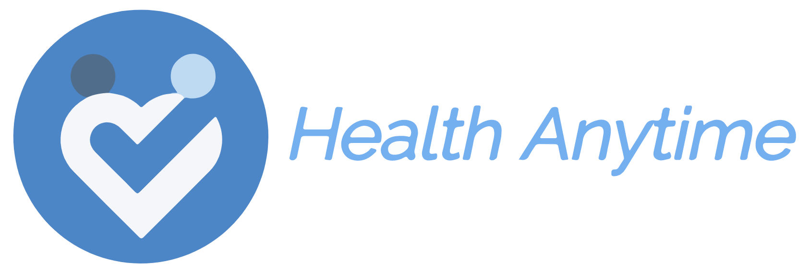

# Health Anytime
### A Mobile Application developed to give patients and doctors  a smoother and better overall experience.

> Your clinic management app

> This app is catered for doctors and patients

> Health android app

**_INSERT GIF OF WORKING APP_**

- Most people will glance at your `README`, _maybe_ star it, and leave
- Ergo, people should understand instantly what your project is about based on your repo

> Tips

- HAVE WHITE SPACE
- MAKE IT PRETTY
- GIFS ARE REALLY COOL

> GIF Tools

- Use <a href="http://recordit.co/" target="_blank">**Recordit**</a> to create quicks screencasts of your desktop and export them as `GIF`s.
- For terminal sessions, there's <a href="https://github.com/chjj/ttystudio" target="_blank">**ttystudio**</a> which also supports exporting `GIF`s.

**Recordit**

**ttystudio**

---

## Table of Contents (Optional)

> If your `README` has a lot of info, section headers might be nice.

- [Clone](#clone)
- [Documentation](#documentation)
- [Contributors](#contributors)
- [Features](#features)
- [Contact](#contact)

---

## Clone

- Clone this repo to your local machine using https://github.com/ob-taka/MAD-Assigment

---

## Documentation 

This app takes health and wellness to another step by helping both doctors and patients. 

Now you will never forget about taking your medicines or be confused by the doctor’s handwriting. While doctors get to keep track of their patients and prescriptions with ease.

---

## Contributors

|             <a href="http://fvcproductions.com" target="_blank">**Kester**</a>             |             <a href="http://fvcproductions.com" target="_blank">**RunLin**</a>             |             <a href="http://fvcproductions.com" target="_blank">**Shrey**</a>              |            <a href="http://fvcproductions.com" target="_blank">**Zachary**</a>             |
| :----------------------------------------------------------------------------------------: | :----------------------------------------------------------------------------------------: | :----------------------------------------------------------------------------------------: | :----------------------------------------------------------------------------------------: |
| <a href="http://github.com/fvcproductions" target="_blank">`https://github.com/EchoKes`</a> | <a href="http://github.com/fvcproductions" target="_blank">`https://github.com/ob-taka`</a> | <a href="http://github.com/fvcproductions" target="_blank">`https://github.com/ShreyChauhan1`</a> | <a href="http://github.com/fvcproductions" target="_blank">`https://github.com/PrimaryHeap`</a> |

- You can just grab their GitHub profile image URL
- You should probably resize their picture using `?s=200` at the end of the image URL.

---

## Features

1. Online platform for ease of access 
2. Track patient’s progress
3. Search patient and medicine on dedicated search bar for Doctors
4. Authenticated sign ins for private and personal
5. Medicine alarm to remind patients it’s time they take dem drugs
6. Allow doctors to prescribe medicine for their patients
7. A database to store Users and Medicine information

---

## Contact

For any queries, leave us a message at xuahuapiaopiaobeifengxiaoxiao@gmail.com

---

## Donations (Optional)

- You could include a <a href="https://cdn.rawgit.com/gratipay/gratipay-badge/2.3.0/dist/gratipay.png" target="_blank">Gratipay</a> link as well.

---

## License

- **[Xue Hua Hua Piao Piao license](http://opensource.org/licenses/mit-license.php)**
- Copyright 2015 © <a href="http://fvcproductions.com" target="_blank">Bei Feng Xiao Xiao</a>.
